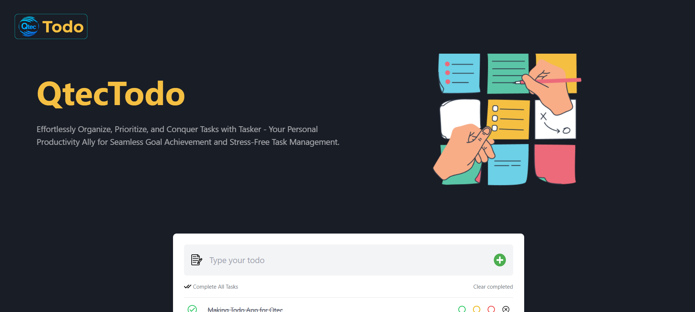

# QtecTodo - An Efficient Todo List App
Welcome to my QtecTodo application! This application is designed to help you manage your tasks efficiently, allowing you to add, edit, mark as completed, and delete tasks with ease. With additional features such as task priorities and local storage integration, we aim to provide a seamless task management experience.



## Features

### Task List Display

- Displays a list of tasks with their respective status (complete or incomplete).
- Each task has options to mark as completed or delete.
- Includes a counter for total tasks and completed tasks, providing an overview of your task list.

### Task Management

- Adds a new task to the list with a specified priority (low, medium, high).
- Edits existing tasks to update task details or priorities.
- Marks tasks as completed to track progress.
- Deletes tasks that are no longer needed, keeping your task list organized.

### Styling

- Styled for a clean and user-friendly interface using HTML and CSS.
- Utilizes TailwindCSS for enhanced styling, ensuring a visually appealing design.

### State Management

- Utilizes React hooks such as useState, useEffect & Redux for efficient state management.
- Integrates local storage to persist tasks even after page refresh, ensuring data consistency.

## Special Features

- **Local Storage Integration**: Persists tasks across sessions, providing a seamless user experience.
- **Filtering System**: Includes a basic filtering system based on task priority, allowing users to focus on tasks of specific importance.

## Tools & Technology Used
- React
- Redux
- TailwindCSS

## How to Run This Project
Just clone the repository then open it to your favourite code editor and give the following commands:

```
npm install
npm run dev
```

And BOOM! It will be opened automatically.